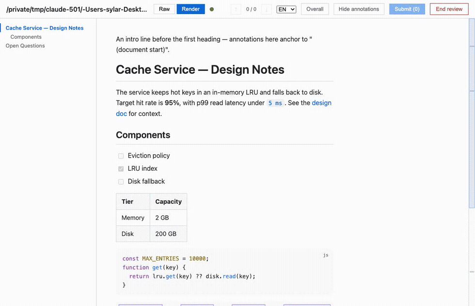

# CC Redline

[](https://github.com/peilinok/cc-redline/actions/workflows/ci.yml)

**English** · [中文](README.zh-CN.md)

An interactive, in-browser **Markdown review loop** packaged as a
[Claude Code](https://claude.com/claude-code) skill. Start a local,
zero-dependency web server that renders a Markdown file with Raw and Render
modes; annotate blocks, sections, selected text, or an exact source line;
submit — and the driving agent applies your annotations back to the file and
the page auto-refreshes. Repeat until you click **End review**.

The UI is bilingual (English / 中文) and switchable at runtime.



## Requirements

- Node.js ≥ 18 on your `PATH` (`node --version`).
- No `npm install` — all front-end libraries are vendored under `assets/vendor/`.

## Install as a Claude Code skill

Copy or symlink this repository into your Claude Code skills directory as
`cc-redline` (e.g. `~/.claude/skills/cc-redline`), then ask the agent to review
a Markdown file, for example: "review this spec in the browser".

## Use it directly

```bash
# start the review server (opens your browser automatically)
node scripts/server.mjs path/to/doc.md --state-dir /tmp/cc-redline-1

# in the driving agent's loop, block until the next submission/done event:
node scripts/wait_for_review.mjs --state-dir /tmp/cc-redline-1 --timeout-sec 540
```

`server.mjs` flags: `--port N` (default: an ephemeral free port on 127.0.0.1),
`--no-open` (don't auto-open the browser).

## How it works

Two processes coordinate through files in `--state-dir`, so any agent/harness
can drive the loop: `scripts/server.mjs` (long-running HTTP server; renders,
serves `/api/*`, watches the file, pushes SSE refreshes) and
`scripts/wait_for_review.mjs` (a blocking one-shot the agent re-runs each round;
its **exit code** reports what happened: 0 = event, 2 = timeout, 3 = server
dead). Annotations are anchored **by text, not line numbers**: each carries a
byte-exact `quotedSource` the agent locates and edits. See [`SKILL.md`](SKILL.md)
for the full agent-facing contract.

## Development

```bash
node --test scripts/tests/*.test.mjs   # use the glob; a bare dir fails on node 22 / Windows
```

No build step, no bundler. Front-end changes are validated manually via the
acceptance checklist in `SKILL.md`.

## License

[MIT](LICENSE). Vendored front-end libraries retain their own licenses under
`assets/vendor/licenses/`; see [`THIRD-PARTY-NOTICES.md`](THIRD-PARTY-NOTICES.md).
