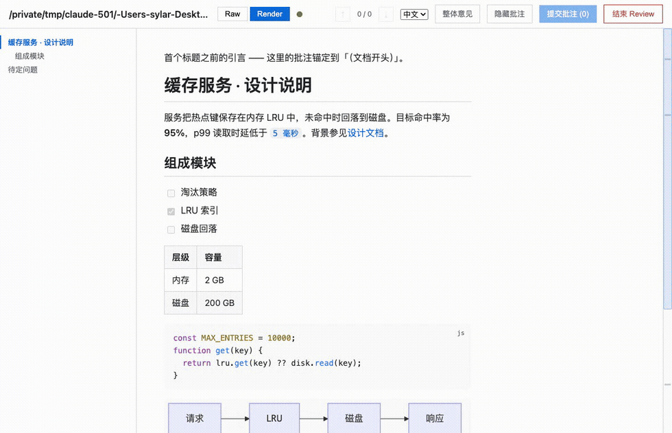

# CC Redline

[English](README.md) · **中文**

一个交互式、在浏览器内进行的 **Markdown 评审循环**，以 [Claude Code](https://claude.com/claude-code) skill 的形式打包。启动一个本地、零依赖的 Web 服务，用 Raw 与 Render 两种模式渲染 Markdown 文件；对块、章节、选中文本或精确源码行做批注；提交后，驱动评审的 agent 把批注应用回文件，页面自动刷新。如此往复，直到你点击 **结束 Review**。

界面支持中英双语，可在运行时切换。



## 环境要求

- `PATH` 中有 Node.js ≥ 18（`node --version`）。
- 无需 `npm install` —— 所有前端库都已 vendored 在 `assets/vendor/`。

## 作为 Claude Code skill 安装

把本仓库复制或软链接到你的 Claude Code skills 目录，命名为 `cc-redline`（例如
`~/.claude/skills/cc-redline`），然后让 agent 评审某个 Markdown 文件，例如：
「在浏览器里 review 这份 spec」。

## 直接使用

```bash
# 启动评审服务（自动打开浏览器）
node scripts/server.mjs path/to/doc.md --state-dir /tmp/cc-redline-1

# 在驱动 agent 的循环里，阻塞直到下一个 submission/done 事件：
node scripts/wait_for_review.mjs --state-dir /tmp/cc-redline-1 --timeout-sec 540
```

`server.mjs` 参数：`--port N`（默认：127.0.0.1 上的随机空闲端口）、
`--no-open`（不自动打开浏览器）。

## 工作原理

两个进程通过 `--state-dir` 里的文件协调，因此任何 agent/harness 都能驱动这个
循环：`scripts/server.mjs`（长时运行的 HTTP 服务；渲染、提供 `/api/*`、监听
文件、经 SSE 推送刷新）与 `scripts/wait_for_review.mjs`（agent 每轮重跑一次的
阻塞式一次性脚本；用**退出码**汇报发生了什么：0 = 有事件，2 = 超时，3 = 服务
已死）。批注**按文本锚定、而非行号**：每条都带一段逐字节精确的 `quotedSource`，
agent 据此定位并编辑。完整的 agent 契约见 [`SKILL.md`](SKILL.md)。

## 开发

```bash
node --test scripts/tests/*.test.mjs   # 用 glob；传目录在 node 22 / Windows 上会失败
```

无 build、无 bundler。前端改动通过 `SKILL.md` 里的验收清单手动验证。

## 许可证

[MIT](LICENSE)。vendored 前端库保留各自的许可证于 `assets/vendor/licenses/`；
另见 [`THIRD-PARTY-NOTICES.md`](THIRD-PARTY-NOTICES.md)。
